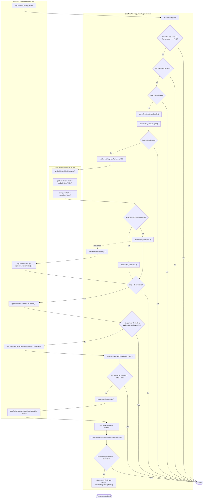

# Developer Notes

## Purpose

This plugin records when a note was worked on by appending the current daily note to a frontmatter list property on every markdown-file modification, unless the note matches a configured exclusion pattern.

## Architecture

The implementation lives in `src/main.ts` and is built into `main.js` with esbuild.

- `DailyNoteWorklogLinkerPlugin` registers a vault `modify` listener.
- A short debounce collapses rapid save events for the same file.
- Excluded-note patterns are normalized and compiled into regex matchers when settings load or save.
- The daily note target is resolved first.
- When `autoCreateDailyNote` is enabled, missing daily notes are created with `app.vault.create()`.
- Missing parent folders for the daily note target are created recursively with `app.vault.createFolder()` when automatic creation is enabled.
- `processFrontMatter()` performs atomic frontmatter updates.
- A suppression window prevents the plugin from responding to its own frontmatter write.

## Control Flow

1. Obsidian emits a vault `modify` event for a markdown file.
2. The plugin ignores suppressed writes and files whose paths match an exclusion pattern.
3. The plugin debounces the file path.
4. The plugin resolves today's daily note path from the Daily Notes core plugin settings.
5. If automatic creation is enabled and today's daily note file is missing, the plugin creates any missing folders and then creates the note in the background.
6. If the daily note still does not exist, the plugin skips the frontmatter update.
7. The plugin checks cached frontmatter for the configured property.
8. If today's daily note is missing from the property, the plugin appends a wikilink to it.

## Program Flow Diagram

The diagram below maps the runtime path to the concrete methods in `DailyNoteWorklogLinkerPlugin` and the Obsidian APIs they depend on. The main early-return gates are `onVaultModify()`, `isSuppressed()`, `isExcludedFile()`, `isCurrentDailyNote()`, and `frontmatterAlreadyTracksDailyNote()`. Frontmatter updates go through `app.fileManager.processFrontMatter()`, while optional background daily-note creation uses `app.vault.create()` and `app.vault.createFolder()`.



## Data Contract

- Setting: `frontmatterProperty`
  - Default: `workedOn`
  - Meaning: the frontmatter list property that receives the daily-note link.
- Setting: `autoCreateDailyNote`
  - Default: `true`
  - Meaning: create today's daily note in the background before linking to it when the note is missing.
- Setting: `ignoreDailyNote`
  - Default: `true`
  - Meaning: skip writing a self-link when today's daily note is the file being edited.
- Setting: `excludedNotePatterns`
  - Default: `[]`
  - Meaning: skip processing notes whose vault-relative paths match any configured wildcard pattern.
- Stored value format:
  - Array items are wikilink strings such as `[[2026-05-20]]` or `[[Daily/2026-05-20]]`.

## Exclusion Matching

- Patterns are matched against the full vault-relative note path, including the `.md` extension.
- `*` is the only wildcard and it spans any part of the path, including subfolders.
- The matcher tests both the plain vault-relative path and a slash-prefixed version so patterns such as `*/Example.md` also match a root-level `Example.md`.
- Blank lines in the settings textarea are ignored when settings are saved.

## Daily Notes Resolution

The plugin uses the Daily Notes core plugin through `app.internalPlugins.getPluginById('daily-notes')`.

- `options.format` controls the date-based file name.
- `options.folder` is used when the daily notes live outside the vault root.
- If Daily Notes is unavailable, the plugin falls back to `YYYY-MM-DD` with no folder prefix.
- When `autoCreateDailyNote` is enabled and the resolved daily note file is missing, the plugin creates the note at the configured path and creates any missing parent folders first.
- When `autoCreateDailyNote` is disabled, the plugin only links to existing daily notes and skips the update if today's daily note does not exist.

## Error Handling

- Frontmatter write failures are logged to the developer console.
- Daily note creation failures are logged to the developer console and the frontmatter update is skipped so the plugin does not add a broken link.
- Disabling automatic creation also prevents broken links because missing daily notes are ignored rather than linked by path alone.
- Failed writes remove the suppression lock so the next real edit can retry.
- Duplicate detection accepts both raw path strings and wikilink strings so existing values are not duplicated.

## Constraints

- The plugin only responds to markdown files.
- It depends on Obsidian 1.4.4+ for `processFrontMatter()`.
- It does not backfill historical notes; it only acts on future modifications.
- Exclusion patterns only support the `*` wildcard.

## Release Automation

Release publishing is handled separately by the GitHub Actions workflow in `.github/workflows/release.yml`.

- The workflow requires the pushed tag to be a GitHub-verified annotated tag.
- The tag must match `manifest.json` exactly, which keeps Obsidian release metadata consistent.
- Release notes are derived from commit subjects rather than hand-authored notes.

Detailed release workflow documentation is in [docs/release-workflow.md](release-workflow.md).

## Verification

Use these commands from the plugin root:

```bash
npm install
npm run build
```

Manual verification:

1. Enable the Daily Notes core plugin and set a date format and optional folder.
2. Enable this plugin.
3. Add an exclusion pattern such as `Templates/*` or `*/Example.md` in the plugin settings.
4. Edit a markdown note that matches the exclusion pattern and confirm its frontmatter is unchanged.
5. Edit any markdown note that does not match an exclusion pattern and is not today's daily note.
6. Confirm the configured frontmatter list contains exactly one link to today's daily note.
7. Edit the same note again and confirm no duplicate entry is added.
8. With automatic creation enabled, delete today's daily note, edit another markdown note, and confirm the daily note is recreated automatically in the configured location.
9. Disable automatic creation, delete today's daily note again, edit another markdown note, and confirm the plugin does not recreate the daily note or add a broken link.

For release verification, follow the release workflow guidance in [docs/release-workflow.md](release-workflow.md).

